# Health Patch

> **Your personal fitness companion with RPG gamification, AI coaching, nutrition tracking, and a social workout community.**

Health Patch is a full-stack wellness platform that transforms your fitness journey into an engaging RPG adventure. Track workouts, log nutrition, earn XP, level up your character, and share workout plans with the community — all powered by AI-driven coaching.

---

## Table of Contents

- [Features](#-features)
- [Tech Stack](#-tech-stack)
- [Architecture Overview](#-architecture-overview)
- [Getting Started](#-getting-started)
  - [Prerequisites](#prerequisites)
  - [Installation](#installation)
  - [Environment Variables](#environment-variables)
  - [Running Migrations](#running-migrations)
- [Docker Compose](#-docker-compose)
- [API Documentation](#-api-documentation)
- [Domain Overview](#-domain-overview)
- [ER Diagram](#-er-diagram)
- [Project Structure](#-project-structure)
- [Contributing](#-contributing)
- [License](#-license)

---

## Features

### Identity & Profile
- User registration and authentication with secure Argon2 password hashing
- OAuth login via Google, GitHub, and Facebook
- Two-factor authentication (TOTP) with QR code setup
- Email verification and password reset via email
- JWT access tokens (1h) and refresh tokens (7d) with device tracking
- Personal profile management (weight, height, age, gender, fitness goals)
- BMI calculation based on profile data
- Soft account deletion

### Social & Plans
- Create, browse, and share public workout plans
- Like, comment, and bookmark favorite plans from the community
- Build a social feed of workout inspiration

### Activity & Tracking
- Log workout sessions linked to predefined plans or standalone
- Manage exercises with primary and secondary muscle group associations
- Create structured workout plans with named trainings, weekday scheduling, and exercise templates
- Track individual exercises with sets, reps, and weights within sessions
- Record and update personal records (PRs) per exercise

### Gamification Engine (RPG)
- Create an RPG character with a class (Warrior, Mage, Rogue, etc.)
- Earn XP from workouts and level up your character
- Character stats: Strength, Endurance, Agility — grow with every session
- Unlock achievements based on milestones and XP thresholds

### AI Coach
- AI-generated personalized workout plans based on your profile and history
- Accept or reject AI suggestions
- Raw AI response storage for transparency and debugging

### Nutrition & Diet
- Daily nutrition diary with water intake and personal notes
- Log meals by type (Breakfast, Lunch, Dinner, Snack)
- Extensive food database with macronutrient data (calories, protein, carbs, fat per 100g)
- Food portions with configurable measure units and gram weights
- Automatic daily macro norm calculation based on user profile
- Day overview with consumed vs remaining macros
- Admin-verified food entries for data accuracy

---

## Tech Stack

| Layer              | Technology                                                       | Purpose                          |
|--------------------|------------------------------------------------------------------|----------------------------------|
| **Language**       | [Python 3.12+](https://www.python.org/)                         | Core language                    |
| **Framework**      | [FastAPI](https://fastapi.tiangolo.com/)                         | Async REST API framework         |
| **ORM**            | [SQLAlchemy 2.x](https://www.sqlalchemy.org/) (async + asyncpg) | Database models & query builder  |
| **Migrations**     | [Alembic](https://alembic.sqlalchemy.org/)                       | Database schema versioning       |
| **Validation**     | [Pydantic v2](https://docs.pydantic.dev/) + pydantic-settings    | Request/response validation & config |
| **Database**       | [PostgreSQL 17](https://www.postgresql.org/)                     | Primary relational data store    |
| **Cache/State**    | [Redis 7](https://redis.io/)                                    | OAuth state, rate limiting, caching |
| **Auth**           | [PyJWT](https://pyjwt.readthedocs.io/) (HS256)                  | JWT token generation & validation |
| **Password**       | [Argon2](https://argon2-cffi.readthedocs.io/)                   | Secure password hashing          |
| **OAuth**          | Google, GitHub, Facebook                                         | Third-party authentication       |
| **2FA**            | [pyotp](https://github.com/pyauth/pyotp) (TOTP)                 | Two-factor authentication        |
| **Email**          | [fastapi-mail](https://github.com/sabuhish/fastapi-mail) + Jinja2 | Email verification & password reset |
| **Scheduler**      | [APScheduler](https://apscheduler.readthedocs.io/)              | Background task scheduling       |
| **Package Manager**| [uv](https://docs.astral.sh/uv/)                                | Dependency management            |
| **Linter/Formatter**| [Ruff](https://docs.astral.sh/ruff/)                           | Code linting & formatting        |
| **Containerization** | [Docker](https://www.docker.com/) / Docker Compose            | Service orchestration            |

---

## Architecture Overview

```
                    Client (Browser / Mobile)
                       | HTTP / REST
                       v
+---------------------------------------------------------+
|               FastAPI Application (:8000)                |
|                                                          |
|  +----------+  +----------+  +--------------------+     |
|  |  Routes   |  |  Schemas |  |  Business Logic    |     |
|  | (Routers) |  |(Pydantic)|  |   (Services)       |     |
|  +----------+  +----------+  +--------------------+     |
|                       |                                  |
|              +--------v--------+                         |
|              |  Repositories   |                         |
|              | (Data Access)   |                         |
|              +--------+--------+                         |
|                       |                                  |
|              +--------v--------+                         |
|              |   SQLAlchemy    |                         |
|              |   ORM Models    |                         |
|              +--------+--------+                         |
|                       |                                  |
|              +--------v--------+                         |
|              |     Alembic     |                         |
|              |   Migrations    |                         |
|              +--------+--------+                         |
+-----------------------|----------------------------------+
                        |
            +-----------+-----------+
            |                       |
            v TCP :5432             v TCP :6379
+-----------------------+  +---------------------+
| PostgreSQL 17 (Alpine)|  |  Redis 7 (Alpine)   |
|                       |  |                     |
| Database: health_patch|  | OAuth state, cache, |
| User:     health      |  | rate limiting       |
+-----------------------+  +---------------------+
```

---

## Getting Started

### Prerequisites

- [Docker](https://docs.docker.com/get-docker/) & [Docker Compose](https://docs.docker.com/compose/install/) (v2+)
- [Python 3.12+](https://www.python.org/downloads/) (for local development)
- [uv](https://docs.astral.sh/uv/getting-started/installation/) (Python package manager)
- [Git](https://git-scm.com/)

### Installation

```bash
# 1. Clone the repository
git clone https://github.com/The-shtrihs/HealthPatch.git
cd HealthPatch

# 2. Create environment file
cp .env.example .env
# Edit .env with your configuration

# 3. Start all services
docker compose up --build

# 4. Access the application
# API:     http://localhost:8000
# Swagger: http://localhost:8000/docs
# ReDoc:   http://localhost:8000/redoc
```

### Local Development (without Docker)

```bash
# 1. Install dependencies (uv creates virtualenv automatically)
uv sync

# 2. Ensure PostgreSQL and Redis are running locally
# (or use docker compose up db redis)

# 3. Run database migrations
alembic upgrade head

# 4. Start the development server
uv run uvicorn src.core.main:app --reload --host 0.0.0.0 --port 8000
```

### Environment Variables

Create a `.env` file in the project root:

```env
# Database
DATABASE_URL=postgresql+asyncpg://health:health_secret@db:5432/health_patch

# Application
SECRET_KEY=your-secret-key-here

# Redis
REDIS_URL=redis://redis:6379/0

# OAuth (optional)
GOOGLE_CLIENT_ID=...
GOOGLE_CLIENT_SECRET=...
GITHUB_CLIENT_ID=...
GITHUB_CLIENT_SECRET=...
FACEBOOK_CLIENT_ID=...
FACEBOOK_CLIENT_SECRET=...

# SMTP (optional - for email verification)
SMTP_HOST=...
SMTP_PORT=587
SMTP_USER=...
SMTP_PASSWORD=...
```

### Running Migrations

```bash
# Create a new migration
alembic revision --autogenerate -m "description of changes"

# Apply all pending migrations
alembic upgrade head

# Rollback one migration
alembic downgrade -1

# View migration history
alembic history
```

---

## Docker Compose

The project uses Docker Compose to orchestrate three services:

```yaml
services:
  db:
    image: postgres:17-alpine
    restart: unless-stopped
    environment:
      POSTGRES_USER: health
      POSTGRES_PASSWORD: health_secret
      POSTGRES_DB: health_patch
    ports:
      - "5432:5432"
    volumes:
      - pg_data:/var/lib/postgresql/data
    healthcheck:
      test: ["CMD-SHELL", "pg_isready -U health -d health_patch"]
      interval: 5s
      timeout: 3s
      retries: 5

  redis:
    image: redis:7-alpine
    ports:
      - "6379:6379"
    volumes:
      - redis_data:/data
    healthcheck:
      test: ["CMD", "redis-cli", "ping"]
      interval: 5s
      timeout: 3s
      retries: 5

  api:
    build: .
    restart: unless-stopped
    ports:
      - "8000:8000"
    env_file:
      - .env
    depends_on:
      db:
        condition: service_healthy
    volumes:
      - .:/app

volumes:
  pg_data:
  redis_data:
```

| Service | Image              | Port | Description                               |
|---------|--------------------|------|-------------------------------------------|
| `db`    | postgres:17-alpine | 5432 | PostgreSQL database with health checks    |
| `redis` | redis:7-alpine    | 6379 | Redis for caching, OAuth state, rate limiting |
| `api`   | Custom (Dockerfile)| 8000 | FastAPI application with hot-reload       |

> **Note:** The `api` service waits for the database health check to pass before starting, ensuring reliable startup order.

---

## API Documentation

Once the application is running, interactive API docs are available at:

| Format  | URL                              |
|---------|----------------------------------|
| Swagger | http://localhost:8000/docs       |
| ReDoc   | http://localhost:8000/redoc      |
| OpenAPI | http://localhost:8000/openapi.json |

---

## Domain Overview

The application is organized into **6 bounded domains**:

| #  | Domain                      | Description                                                  | Key Entities                                                                     |
|----|-----------------------------|--------------------------------------------------------------|----------------------------------------------------------------------------------|
| 1  | **Identity & Profile**      | User accounts, authentication (JWT, OAuth, 2FA), and personal profiles | `USER`, `USER_PROFILE`, `REFRESH_TOKEN`                                         |
| 2  | **Social & Plans**          | Community workout plans with social interactions             | `WORKOUT_PLAN`, `PLAN_COMMENT`, `PLAN_LIKE`, `PLAN_BOOKMARK`                     |
| 3  | **Activity & Tracking**     | Workout logging, exercise tracking, and personal records     | `MUSCLE_GROUP`, `EXERCISE_MUSCLE_GROUP`, `EXERCISE`, `PLAN_TRAINING`, `PLAN_TRAINING_EXERCISE`, `WORKOUT_SESSION`, `EXERCISE_SESSION`, `WORKOUT_SET`, `PERSONAL_RECORD` |
| 4  | **Gamification Engine (RPG)** | Character progression, stats, and achievements             | `CHARACTER`, `CHARACTER_STAT`, `ACHIEVEMENT`, `USER_ACHIEVEMENT`                  |
| 5  | **AI Coach**                | AI-powered personalized workout plan generation              | `AI_WORKOUT_PLAN`                                                                |
| 6  | **Nutrition & Diet**        | Daily food diary, meal logging, and macronutrient tracking   | `FOOD`, `FOOD_PORTION`, `DAILY_DIARY`, `MEAL_ENTRY`                              |

---

## ER Diagram

```mermaid
erDiagram
    USER {
        int id PK
        string name
        string email UK
        string password_hash "nullable"
        boolean is_verified
        string oauth_provider "nullable"
        string oauth_provider_id "nullable"
        string avatar_url "nullable"
        string totp_secret "nullable"
        boolean is_2fa_enabled
        boolean is_active
        datetime created_at
        datetime updated_at
    }

    USER_PROFILE {
        int id PK
        int user_id FK
        float weight "nullable"
        float height "nullable"
        int age "nullable"
        enum gender "nullable"
        enum fitness_goal "nullable"
    }

    REFRESH_TOKEN {
        int id PK
        string token UK
        int user_id FK
        datetime expires_at
        boolean is_revoked
        string device_info "nullable"
        datetime created_at
        datetime updated_at
    }

    MUSCLE_GROUP {
        int id PK
        string name UK
    }

    EXERCISE {
        int id PK
        string name
        int primary_muscle_group_id FK "nullable"
    }

    EXERCISE_MUSCLE_GROUP {
        int exercise_id PK_FK
        int muscle_group_id PK_FK
    }

    WORKOUT_PLAN {
        int id PK
        int author_id FK
        string title
        string description "nullable"
        boolean is_public
        datetime created_at
        datetime updated_at
    }

    PLAN_TRAINING {
        int id PK
        int plan_id FK
        string name
        enum weekday "nullable"
        int order_num
    }

    PLAN_TRAINING_EXERCISE {
        int id PK
        int plan_training_id FK
        int exercise_id FK
        int order_num
        int target_sets
        int target_reps
        float target_weight_pct "nullable"
    }

    PERSONAL_RECORD {
        int id PK
        int user_id FK
        int exercise_id FK
        float weight
        datetime recorded_at
    }

    WORKOUT_SESSION {
        int id PK
        int user_id FK
        int plan_training_id FK "nullable"
        datetime started_at
        datetime ended_at "nullable"
    }

    EXERCISE_SESSION {
        int id PK
        int workout_session_id FK
        int exercise_id FK
        int order_num
        boolean is_from_template
    }

    WORKOUT_SET {
        int id PK
        int exercise_session_id FK
        int set_number
        int reps
        float weight
    }

    PLAN_COMMENT {
        int id PK
        int plan_id FK
        int user_id FK
        string text
        datetime created_at
        datetime updated_at
    }

    PLAN_LIKE {
        int plan_id FK
        int user_id FK
        datetime created_at
        datetime updated_at
    }

    PLAN_BOOKMARK {
        int plan_id FK
        int user_id FK
        datetime saved_at
    }

    CHARACTER {
        int id PK
        int user_id FK
        string class
        int level
        int current_xp
    }

    CHARACTER_STAT {
        int id PK
        int character_id FK
        int strength
        int endurance
        int agility
    }

    ACHIEVEMENT {
        int id PK
        string title
        int required_xp
    }

    USER_ACHIEVEMENT {
        int user_id FK
        int achievement_id FK
        datetime unlocked_at
    }

    AI_WORKOUT_PLAN {
        int id PK
        int user_id FK
        datetime generated_at
        json raw_ai_response
        boolean is_accepted
    }

    FOOD {
        int id PK
        int fdc_id "nullable, USDA ID"
        string name
        string brand_name "nullable"
        string data_type "nullable"
        float calories_per_100g
        float protein_per_100g
        float carbs_per_100g
        float fat_per_100g
        boolean is_verified
    }

    FOOD_PORTION {
        int id PK
        int food_id FK
        float amount
        string measure_unit_name
        float gram_weight
    }

    DAILY_DIARY {
        int id PK
        int user_id FK
        date target_date
        int water_ml
        string notes "nullable"
    }

    MEAL_ENTRY {
        int id PK
        int daily_diary_id FK
        int food_id FK
        string meal_type "Breakfast, Lunch, Dinner, Snack"
        float weight_grams
    }

    %% Identity
    USER ||--|| USER_PROFILE : "has"
    USER ||--o{ REFRESH_TOKEN : "has"
    USER ||--|| CHARACTER : "plays as"

    %% Activity - Exercises
    MUSCLE_GROUP ||--o{ EXERCISE : "primary for"
    MUSCLE_GROUP ||--o{ EXERCISE_MUSCLE_GROUP : "secondary in"
    EXERCISE ||--o{ EXERCISE_MUSCLE_GROUP : "has secondary"

    %% Activity - Plans
    USER ||--o{ WORKOUT_PLAN : "creates"
    WORKOUT_PLAN ||--o{ PLAN_TRAINING : "contains"
    PLAN_TRAINING ||--o{ PLAN_TRAINING_EXERCISE : "includes"
    EXERCISE ||--o{ PLAN_TRAINING_EXERCISE : "used in"

    %% Activity - Sessions
    USER ||--o{ WORKOUT_SESSION : "completes"
    PLAN_TRAINING ||--o{ WORKOUT_SESSION : "used in"
    WORKOUT_SESSION ||--o{ EXERCISE_SESSION : "includes"
    EXERCISE ||--o{ EXERCISE_SESSION : "is performed in"
    EXERCISE_SESSION ||--o{ WORKOUT_SET : "contains"

    %% Activity - Personal Records
    USER ||--o{ PERSONAL_RECORD : "holds"
    EXERCISE ||--o{ PERSONAL_RECORD : "measured in"

    %% Social
    USER ||--o{ PLAN_COMMENT : "writes"
    USER ||--o{ PLAN_LIKE : "likes"
    USER ||--o{ PLAN_BOOKMARK : "saves"
    WORKOUT_PLAN ||--o{ PLAN_COMMENT : "has"
    WORKOUT_PLAN ||--o{ PLAN_LIKE : "receives"
    WORKOUT_PLAN ||--o{ PLAN_BOOKMARK : "saved as"

    %% Gamification
    CHARACTER ||--|| CHARACTER_STAT : "has attributes"
    ACHIEVEMENT ||--o{ USER_ACHIEVEMENT : "awarded to"
    USER ||--o{ USER_ACHIEVEMENT : "unlocks"

    %% AI
    USER ||--o{ AI_WORKOUT_PLAN : "receives"

    %% Nutrition
    USER ||--o{ DAILY_DIARY : "tracks nutrition"
    DAILY_DIARY ||--o{ MEAL_ENTRY : "has meals"
    FOOD ||--o{ MEAL_ENTRY : "is consumed in"
    FOOD ||--o{ FOOD_PORTION : "has portions"
```



### Entity Relationship Summary

| Relationship | Type | Description |
|---|---|---|
| `USER` -> `USER_PROFILE` | One-to-One | Each user has exactly one profile |
| `USER` -> `REFRESH_TOKEN` | One-to-Many | A user can have multiple active sessions |
| `USER` -> `CHARACTER` | One-to-One | Each user plays as one RPG character |
| `USER` -> `WORKOUT_PLAN` | One-to-Many | A user can author multiple workout plans |
| `USER` -> `WORKOUT_SESSION` | One-to-Many | A user can complete many workout sessions |
| `USER` -> `PERSONAL_RECORD` | One-to-Many | A user tracks personal records per exercise |
| `USER` -> `DAILY_DIARY` | One-to-Many | A user tracks nutrition over multiple days |
| `USER` -> `AI_WORKOUT_PLAN` | One-to-Many | A user receives multiple AI-generated plans |
| `USER` -> `USER_ACHIEVEMENT` | One-to-Many | A user can unlock multiple achievements |
| `MUSCLE_GROUP` -> `EXERCISE` | One-to-Many | A muscle group is primary for multiple exercises |
| `EXERCISE` <-> `MUSCLE_GROUP` | Many-to-Many | Exercises have secondary muscle groups via junction table |
| `WORKOUT_PLAN` -> `PLAN_TRAINING` | One-to-Many | A plan contains multiple named trainings |
| `PLAN_TRAINING` -> `PLAN_TRAINING_EXERCISE` | One-to-Many | A training includes multiple exercises with targets |
| `PLAN_TRAINING` -> `WORKOUT_SESSION` | One-to-Many | A training can be used in multiple sessions |
| `WORKOUT_SESSION` -> `EXERCISE_SESSION` | One-to-Many | A session includes multiple exercises |
| `EXERCISE` -> `EXERCISE_SESSION` | One-to-Many | An exercise is performed in multiple sessions |
| `EXERCISE_SESSION` -> `WORKOUT_SET` | One-to-Many | Each exercise session contains multiple sets |
| `EXERCISE` -> `PERSONAL_RECORD` | One-to-Many | An exercise has personal records from multiple users |
| `WORKOUT_PLAN` -> `PLAN_COMMENT` | One-to-Many | Plans can receive multiple comments |
| `WORKOUT_PLAN` -> `PLAN_LIKE` | One-to-Many | Plans can receive multiple likes |
| `WORKOUT_PLAN` -> `PLAN_BOOKMARK` | One-to-Many | Plans can be bookmarked by multiple users |
| `CHARACTER` -> `CHARACTER_STAT` | One-to-One | Each character has one set of stat attributes |
| `ACHIEVEMENT` -> `USER_ACHIEVEMENT` | One-to-Many | An achievement can be awarded to many users |
| `DAILY_DIARY` -> `MEAL_ENTRY` | One-to-Many | A diary entry has multiple meal logs |
| `FOOD` -> `MEAL_ENTRY` | One-to-Many | A food item can appear in multiple meals |
| `FOOD` -> `FOOD_PORTION` | One-to-Many | A food item can have multiple portion definitions |

---

## Project Structure

```
health-patch/
├── src/
│   ├── __init__.py
│   ├── core/
│   │   ├── __init__.py
│   │   ├── main.py                  # FastAPI application entry point
│   │   ├── config.py                # Settings & environment config (pydantic-settings)
│   │   ├── database.py              # SQLAlchemy async engine & session
│   │   ├── base.py                  # Base ORM model, TimestampMixin, IsActiveMixin
│   │   ├── constants.py             # App-wide constants (pagination, rate limits, TTLs)
│   │   ├── exceptions.py            # Custom exception hierarchy
│   │   ├── redis.py                 # Redis connection pool
│   │   └── tasks/                   # Background tasks & APScheduler
│   ├── models/                      # SQLAlchemy ORM models
│   │   ├── __init__.py
│   │   ├── user.py                  # USER, USER_PROFILE, REFRESH_TOKEN
│   │   ├── activity.py              # MUSCLE_GROUP, EXERCISE, WORKOUT_PLAN, PLAN_TRAINING, WORKOUT_SESSION, EXERCISE_SESSION, WORKOUT_SET, PERSONAL_RECORD
│   │   ├── social.py                # PLAN_COMMENT, PLAN_LIKE, PLAN_BOOKMARK
│   │   └── nutrition.py             # FOOD, FOOD_PORTION, DAILY_DIARY, MEAL_ENTRY
│   ├── schemas/                     # Pydantic request/response schemas
│   │   ├── auth.py
│   │   ├── profile.py
│   │   ├── activity.py
│   │   ├── nutrition.py
│   │   └── oauth.py
│   ├── routes/                      # API route handlers
│   │   ├── auth.py
│   │   ├── profile.py
│   │   ├── activity.py
│   │   ├── nutrition.py
│   │   ├── oauth.py
│   │   └── dependencies.py          # FastAPI dependency injection
│   ├── services/                    # Business logic layer
│   │   ├── auth.py
│   │   ├── profile.py
│   │   ├── activity.py
│   │   ├── nutrition.py
│   │   ├── nutrition_calculators.py
│   │   ├── oauth.py
│   │   ├── mail.py
│   │   └── totp.py
│   ├── repositories/                # Data access layer
│   ├── middleware/                   # Custom middleware (rate limiting, etc.)
│   ├── templates/                   # Jinja2 email templates
│   ├── scripts/                     # One-off data loading scripts
│   └── utils/                       # Utility functions
├── migrations/                      # Alembic database migrations
│   ├── versions/
│   ├── env.py
│   └── script.py.mako
├── tests/                           # pytest test suite
├── alembic.ini                      # Alembic configuration
├── docker-compose.yml               # Docker Compose orchestration
├── Dockerfile                       # Container build instructions
├── pyproject.toml                   # Project dependencies & config (uv)
├── .env.example                     # Environment variables template
├── .gitignore
└── README.md
```

---

## Contributing

Contributions are welcome! Please follow these steps:

1. **Fork** the repository
2. **Create** a feature branch:
   ```bash
   git checkout -b feature/amazing-feature
   ```
3. **Commit** your changes:
   ```bash
   git commit -m "feat: add amazing feature"
   ```
4. **Push** to the branch:
   ```bash
   git push origin feature/amazing-feature
   ```
5. **Open** a Pull Request

### Commit Convention

This project follows [Conventional Commits](https://www.conventionalcommits.org/):

| Prefix     | Purpose                   |
|------------|---------------------------|
| `feat:`    | New feature               |
| `fix:`     | Bug fix                   |
| `docs:`    | Documentation changes     |
| `refactor:`| Code refactoring          |
| `test:`    | Adding or updating tests  |
| `chore:`   | Maintenance tasks         |

---

## License

This project is licensed under the **MIT License** — see the [LICENSE](LICENSE) file for details.

---

<p align="center">
  Made by <a href="https://github.com/Alysseum17">Daniil Marchenko</a>
  <a href="https://github.com/Maks9m">Maksym Kramarenko</a>
  <a href="https://github.com/LobanMihajlo">Mikhailo Loban</a>
  <a href="https://github.com/0utlaw0">Oleksandr Bondarchuk(Project Manager)</a>
</p>
