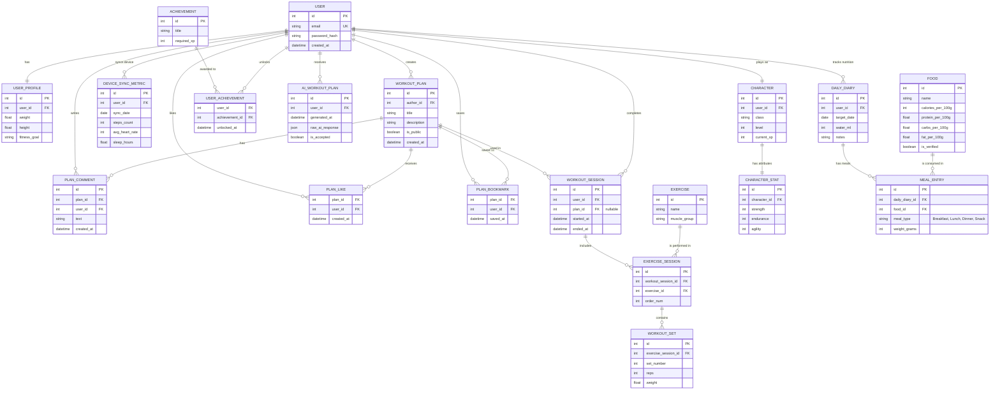

# 🏋️ Health Patch

> **Your personal fitness companion with RPG gamification, AI coaching, nutrition tracking, and a social workout community.**

Health Patch is a full-stack wellness platform that transforms your fitness journey into an engaging RPG adventure. Track workouts, log nutrition, sync wearable devices, earn XP, level up your character, and share workout plans with the community — all powered by AI-driven coaching.

---

## 📑 Table of Contents

- [Features](#-features)
- [Tech Stack](#-tech-stack)
- [Architecture Overview](#-architecture-overview)
- [Getting Started](#-getting-started)
  - [Prerequisites](#prerequisites)
  - [Installation](#installation)
  - [Environment Variables](#environment-variables)
  - [Running Migrations](#running-migrations)
- [Docker Compose](#-docker-compose)
- [API Documentation](#-api-documentation)
- [Domain Overview](#-domain-overview)
- [ER Diagram](#-er-diagram)
- [Project Structure](#-project-structure)
- [Contributing](#-contributing)
- [License](#-license)

---

## ✨ Features

### 🔐 Identity & Profile
- User registration and authentication with secure password hashing
- Personal profile management (weight, height, fitness goals)

### 🏆 Social & Plans
- Create, browse, and share public workout plans
- Like, comment, and bookmark favorite plans from the community
- Build a social feed of workout inspiration

### 🏃 Activity & Tracking
- Log workout sessions linked to predefined or custom plans
- Track individual exercises with sets, reps, and weights
- Ordered exercise sessions within each workout
- Sync metrics from wearable devices (steps, heart rate, sleep)

### 🎮 Gamification Engine (RPG)
- Create an RPG character with a class (Warrior, Mage, Rogue, etc.)
- Earn XP from workouts and level up your character
- Character stats: Strength, Endurance, Agility — grow with every session
- Unlock achievements based on milestones and XP thresholds

### 🤖 AI Coach
- AI-generated personalized workout plans based on your profile and history
- Accept or reject AI suggestions
- Raw AI response storage for transparency and debugging

### 🥗 Nutrition & Diet
- Daily nutrition diary with water intake and personal notes
- Log meals by type (Breakfast, Lunch, Dinner, Snack)
- Extensive food database with macronutrient data (calories, protein, carbs, fat per 100g)
- Admin-verified food entries for data accuracy

---

## 🛠 Tech Stack

| Layer              | Technology                                                       | Purpose                          |
|--------------------|------------------------------------------------------------------|----------------------------------|
| **Backend**        | [FastAPI](https://fastapi.tiangolo.com/)                         | Async REST API framework         |
| **ORM**            | [SQLAlchemy](https://www.sqlalchemy.org/)                        | Database models & query builder  |
| **Migrations**     | [Alembic](https://alembic.sqlalchemy.org/)                       | Database schema versioning       |
| **Database**       | [PostgreSQL 17](https://www.postgresql.org/)                     | Primary relational data store    |
| **Containerization** | [Docker](https://www.docker.com/) / Docker Compose            | Service orchestration            |
| **Language**       | Python 3.11+                                                     | Core language                    |

---

## 🏗 Architecture Overview

```
┌─────────────────────────────────────────────────────┐
│                    Client (Browser / Mobile)         │
└──────────────────────┬──────────────────────────────┘
                       │ HTTP / REST
                       ▼
┌─────────────────────────────────────────────────────┐
│               FastAPI Application (:8000)            │
│                                                      │
│  ┌──────────┐  ┌──────────┐  ┌───────────────────┐  │
│  │  Routes   │  │  Schemas │  │  Business Logic   │  │
│  │ (Routers) │  │(Pydantic)│  │   (Services)      │  │
│  └──────────┘  └──────────┘  └───────────────────┘  │
│                       │                              │
│              ┌────────▼────────┐                     │
│              │   SQLAlchemy    │                      │
│              │   ORM Models    │                      │
│              └────────┬────────┘                     │
│                       │                              │
│              ┌────────▼────────┐                     │
│              │     Alembic     │                      │
│              │   Migrations    │                      │
│              └────────┬────────┘                     │
└───────────────────────┼─────────────────────────────┘
                        │ TCP :5432
                        ▼
┌─────────────────────────────────────────────────────┐
│            PostgreSQL 17 (Alpine) Database            │
│                                                      │
│         Database: health_patch                       │
│         User:     health                             │
└─────────────────────────────────────────────────────┘
```

---

## 🚀 Getting Started

### Prerequisites

- [Docker](https://docs.docker.com/get-docker/) & [Docker Compose](https://docs.docker.com/compose/install/) (v2+)
- [Python 3.11+](https://www.python.org/downloads/) (for local development)
- [Git](https://git-scm.com/)

### Installation

```bash
# 1. Clone the repository
git clone https://github.com/Alysseum17/health-patch.git
cd health-patch

# 2. Create environment file
cp .env.example .env
# Edit .env with your configuration

# 3. Start all services
docker compose up --build

# 4. Access the application
# API:     http://localhost:8000
# Swagger: http://localhost:8000/docs
# ReDoc:   http://localhost:8000/redoc
```

### Local Development (without Docker)

```bash
# 1. Create a virtual environment
python -m venv venv
source venv/bin/activate  # Linux/macOS
# venv\Scripts\activate   # Windows

# 2. Install dependencies
pip install -r requirements.txt

# 3. Run database migrations
alembic upgrade head

# 4. Start the development server
uvicorn app.main:app --reload --host 0.0.0.0 --port 8000
```

### Environment Variables

Create a `.env` file in the project root:

```env
# Database
DATABASE_URL=postgresql+asyncpg://health:health_secret@db:5432/health_patch

# Application
APP_ENV=development
SECRET_KEY=your-secret-key-here
DEBUG=true

# AI Coach (optional)
AI_API_KEY=your-ai-api-key
AI_MODEL=gpt-4
```

### Running Migrations

```bash
# Create a new migration
alembic revision --autogenerate -m "description of changes"

# Apply all pending migrations
alembic upgrade head

# Rollback one migration
alembic downgrade -1

# View migration history
alembic history
```

---

## 🐳 Docker Compose

The project uses Docker Compose to orchestrate two services:

```yaml
services:
  db:
    image: postgres:17-alpine
    restart: unless-stopped
    environment:
      POSTGRES_USER: health
      POSTGRES_PASSWORD: health_secret
      POSTGRES_DB: health_patch
    ports:
      - "5432:5432"
    volumes:
      - pg_data:/var/lib/postgresql/data
    healthcheck:
      test: ["CMD-SHELL", "pg_isready -U health -d health_patch"]
      interval: 5s
      timeout: 3s
      retries: 5

  api:
    build: .
    restart: unless-stopped
    ports:
      - "8000:8000"
    env_file:
      - .env
    depends_on:
      db:
        condition: service_healthy
    volumes:
      - .:/app

volumes:
  pg_data:
```

| Service | Image              | Port | Description                               |
|---------|--------------------|------|-------------------------------------------|
| `db`    | postgres:17-alpine | 5432 | PostgreSQL database with health checks    |
| `api`   | Custom (Dockerfile)| 8000 | FastAPI application with hot-reload       |

> **Note:** The `api` service waits for the database health check to pass before starting, ensuring reliable startup order.

---

## 📖 API Documentation

Once the application is running, interactive API docs are available at:

| Format  | URL                              |
|---------|----------------------------------|
| Swagger | http://localhost:8000/docs       |
| ReDoc   | http://localhost:8000/redoc      |
| OpenAPI | http://localhost:8000/openapi.json |

---

## 🧩 Domain Overview

The application is organized into **6 bounded domains**:

| #  | Domain                      | Description                                                  | Key Entities                                                                     |
|----|-----------------------------|--------------------------------------------------------------|----------------------------------------------------------------------------------|
| 1  | **Identity & Profile**      | User accounts, authentication, and personal profiles         | `USER`, `USER_PROFILE`                                                           |
| 2  | **Social & Plans**          | Community workout plans with social interactions             | `WORKOUT_PLAN`, `PLAN_COMMENT`, `PLAN_LIKE`, `PLAN_BOOKMARK`                     |
| 3  | **Activity & Tracking**     | Workout logging, exercise tracking, and device sync          | `EXERCISE`, `WORKOUT_SESSION`, `EXERCISE_SESSION`, `WORKOUT_SET`, `DEVICE_SYNC_METRIC` |
| 4  | **Gamification Engine (RPG)** | Character progression, stats, and achievements             | `CHARACTER`, `CHARACTER_STAT`, `ACHIEVEMENT`, `USER_ACHIEVEMENT`                  |
| 5  | **AI Coach**                | AI-powered personalized workout plan generation              | `AI_WORKOUT_PLAN`                                                                |
| 6  | **Nutrition & Diet**        | Daily food diary, meal logging, and macronutrient tracking   | `FOOD`, `DAILY_DIARY`, `MEAL_ENTRY`                                              |

---

## 📐 ER Diagram



### Entity Relationship Summary

| Relationship | Type | Description |
|---|---|---|
| `USER` → `USER_PROFILE` | One-to-One | Each user has exactly one profile |
| `USER` → `CHARACTER` | One-to-One | Each user plays as one RPG character |
| `USER` → `WORKOUT_PLAN` | One-to-Many | A user can author multiple workout plans |
| `USER` → `WORKOUT_SESSION` | One-to-Many | A user can complete many workout sessions |
| `USER` → `DEVICE_SYNC_METRIC` | One-to-Many | A user syncs device metrics daily |
| `USER` → `DAILY_DIARY` | One-to-Many | A user tracks nutrition over multiple days |
| `USER` → `AI_WORKOUT_PLAN` | One-to-Many | A user receives multiple AI-generated plans |
| `USER` → `USER_ACHIEVEMENT` | One-to-Many | A user can unlock multiple achievements |
| `WORKOUT_PLAN` → `PLAN_COMMENT` | One-to-Many | Plans can receive multiple comments |
| `WORKOUT_PLAN` → `PLAN_LIKE` | One-to-Many | Plans can receive multiple likes |
| `WORKOUT_PLAN` → `PLAN_BOOKMARK` | One-to-Many | Plans can be bookmarked by multiple users |
| `WORKOUT_PLAN` → `WORKOUT_SESSION` | One-to-Many | A plan can be used in multiple sessions |
| `WORKOUT_SESSION` → `EXERCISE_SESSION` | One-to-Many | A session includes multiple exercises |
| `EXERCISE` → `EXERCISE_SESSION` | One-to-Many | An exercise is performed in multiple sessions |
| `EXERCISE_SESSION` → `WORKOUT_SET` | One-to-Many | Each exercise session contains multiple sets |
| `CHARACTER` → `CHARACTER_STAT` | One-to-One | Each character has one set of stat attributes |
| `ACHIEVEMENT` → `USER_ACHIEVEMENT` | One-to-Many | An achievement can be awarded to many users |
| `DAILY_DIARY` → `MEAL_ENTRY` | One-to-Many | A diary entry has multiple meal logs |
| `FOOD` → `MEAL_ENTRY` | One-to-Many | A food item can appear in multiple meals |

---

## 📁 Project Structure

```
health-patch/
├── src/
│   ├── __init__.py
│   ├── core/ 
│   │   ├── __init__.py
│       ├── main.py                  # FastAPI application entry point
│       ├── config.py                # Settings & environment config
│       ├── database.py              # SQLAlchemy engine & session
│       ├── base.py                  # Base ORM model
│   ├── models/                  # SQLAlchemy ORM models
│   │   ├── __init__.py
│   │   ├── user.py              # USER, USER_PROFILE
│   │   ├── workout.py           # WORKOUT_PLAN, WORKOUT_SESSION
│   │   ├── exercise.py          # EXERCISE, EXERCISE_SESSION, WORKOUT_SET
│   │   ├── social.py            # PLAN_COMMENT, PLAN_LIKE, PLAN_BOOKMARK
│   │   ├── gamification.py      # CHARACTER, CHARACTER_STAT, ACHIEVEMENT
│   │   ├── device.py            # DEVICE_SYNC_METRIC
│   │   ├── ai.py                # AI_WORKOUT_PLAN
│   │   └── nutrition.py         # FOOD, DAILY_DIARY, MEAL_ENTRY
│   ├── schemas/                 # Pydantic request/response schemas
│   │   └── ...
│   ├── routers/                 # API route handlers
│   │   └── ...
│   └── services/                # Business logic layer
│       └── ...
├── alembic/                     # Database migrations
│   ├── versions/
│   ├── env.py
│   └── script.py.mako
├── alembic.ini                  # Alembic configuration
├── docker-compose.yml           # Docker Compose orchestration
├── Dockerfile                   # Container build instructions
├── requirements.txt             # Python dependencies
├── .env.example                 # Environment variables template
├── .gitignore
└── README.md
```

---

## 🤝 Contributing

Contributions are welcome! Please follow these steps:

1. **Fork** the repository
2. **Create** a feature branch:
   ```bash
   git checkout -b feature/amazing-feature
   ```
3. **Commit** your changes:
   ```bash
   git commit -m "feat: add amazing feature"
   ```
4. **Push** to the branch:
   ```bash
   git push origin feature/amazing-feature
   ```
5. **Open** a Pull Request

### Commit Convention

This project follows [Conventional Commits](https://www.conventionalcommits.org/):

| Prefix     | Purpose                   |
|------------|---------------------------|
| `feat:`    | New feature               |
| `fix:`     | Bug fix                   |
| `docs:`    | Documentation changes     |
| `refactor:`| Code refactoring          |
| `test:`    | Adding or updating tests  |
| `chore:`   | Maintenance tasks         |

---

## 📜 License

This project is licensed under the **MIT License** — see the [LICENSE](LICENSE) file for details.

---

<p align="center">
  Made by <a href="https://github.com/Alysseum17">Daniil Marchenko</a>
  ❤️      <a href="https://github.com/Maks9m">Maksym Kramarenko</a>
❤️        <a href="https://github.com/LobanMihajlo">Mikhailo Loban</a>
❤️        <a href="https://github.com/0utlaw0">Oleksandr Bondarchuk(Project Manager)</a>
</p>